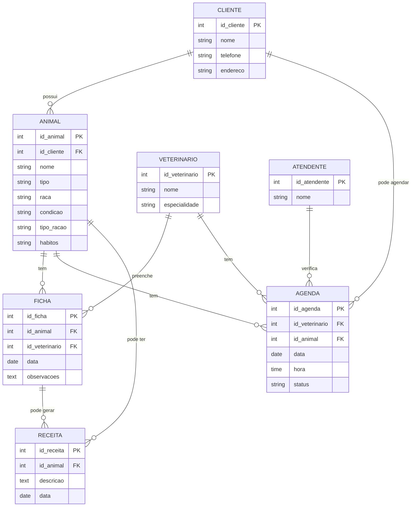

# Denner_Ferreira

---
# 1. Descrição do sistema

Nome da clinica:

Dog&Cat Good Life

Autor: Denner Ferreira de Morais
=======
O sistema tem como objetivo atender apenas cães e gatos, para ser realizado esses atendimentos os tutores dos animais devem criar um cadastro para o animal e para si mesmo caso não tenham. Para que os animais recebam o melhor tratamento possivel os tutores devem informar ao médico veterinário quais são as condições atuais do animal, hábitos e tipo de ração.
O tutor será atendido por um atendente que verificará se há agendamento marcado, caso não há o tutor juntamente com seu animal ficará em uma fila de espera dependendo da gravidade do problema. O veterinário faz uma espécie de intrevista com o tutor. Cada animal que recebeu atendimento terá uma ficha e prontuário, o atendimento gera uma receita para o animal.

1. Uma clínica veterinária atende apenas os animais: gatos e cachorros. 
2. Os clientes devem fazer um cadastro de si e dos animais. 
3. Os clientes devem informar as condições nas quais os animais chegam. 
4. Os clientes devem informar o tipo de ração que o animal come.
5. O cliente deve informar hábitos do animal. 
6. Para cada animal é possível que mais de um veterinário o atenda. 
7. Os animais podem chegar e serem atendidos de acordo com uma agenda do dia. 
8. Cada animal atendido receberá uma ficha e um prontuário. 
9. Outros donos podem querer marcar horários de atendimento futuro. 
10. O atendimento gera uma receita para o animal. 
11. Quando um cliente chega na clínica veterinária ele é atendido por um atendente. 
12. O atendente deve verificar se existe agenda disponível com um veterinário. 
13. O atendente deve colocar o cliente e seu animal na fila de espera, se for o caso. 
14. O atendente deve levar o cliente e o animal até o veterinário. 
15. O veterinário deve realizar uma entrevista com o dono do animal. 
16. O resultado da entrevista deve ir para um formulário. 
17. O veterinário deverá examinar o animal e anotar em prontuário(ficha) suas observações. 
18. Animal terá prioridade dependendo da situação atual.
19. Dependendo da situação do animal este receberá uma receita.
20. Horário de funcionamento.
21. Formas de pagamento.
22. Pesagem do animal.
23. A clínica da descontos aos clientes que tem menos condições.
24. A clínica tem atendimento de plantão.

---
# 2. Diagrama do banco de dados

---
# 3. Diagramas de casos de uso

---
# 4. Principais telas do sistema

---
# 5. Arquitetura do sistema

